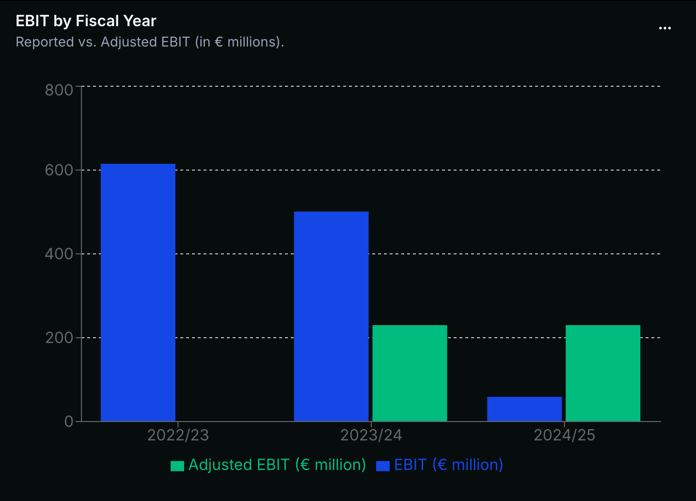
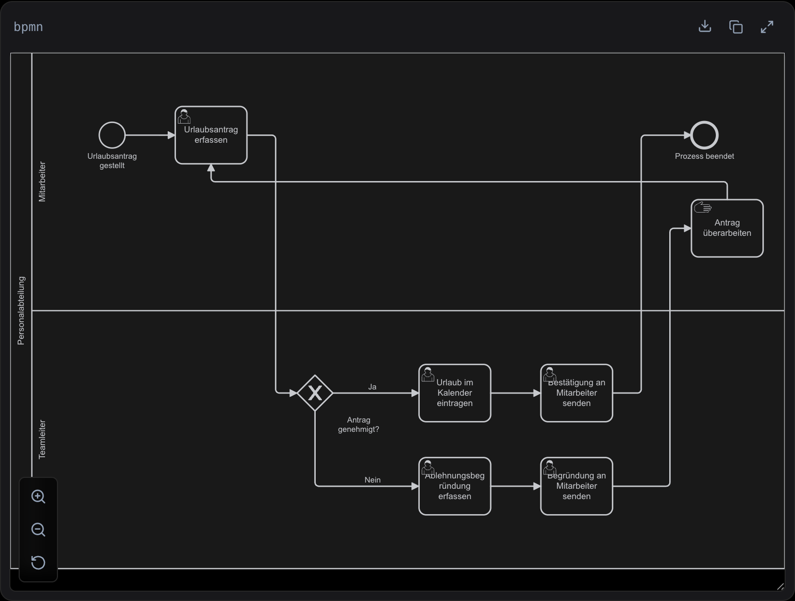

# Streamdown Registry

A small [shadcn](https://ui.shadcn.com/docs/registry) registry of **streaming-aware
[Streamdown](https://streamdown.ai) custom renderers** that upgrade LLM code
fences into live, interactive components — charts and BPMN diagrams — directly
inside a streamed Markdown message.


**Topics:** `streamdown` · `shadcn-registry` · `ai` · `llm` · `recharts` ·
`charts` · `data-visualization` · `bpmn` · `diagrams` · `react`

---

## Components

| Component | Fence | What it renders |
| --- | --- | --- |
| [Streamdown Recharts](#streamdown-recharts) | ` ```recharts-json ` | Bar, line, area, pie &amp; scatter charts with a table view and CSV/XLSX/PNG export |
| [Streamdown BPMN](#streamdown-bpmn) | ` ```bpmn ` | Interactive BPMN 2.0 diagrams with pan, zoom, fullscreen and SVG/BPMN export |

Both are **streaming-aware**: while a fence is still arriving they show a skeleton
instead of flashing a parse error, then upgrade to the live component once the
block closes.

---

## Streamdown Recharts



The model emits a fenced `recharts-json` block; the renderer parses it, validates
it with Zod, and draws a [Recharts](https://recharts.org) chart.

### Install

```bash
npx shadcn@latest add https://bitbasti.com/r/streamdown-recharts.json
```

Installs into `components/streamdown-recharts/` and pulls the `button` and
`dropdown-menu` primitives plus the chart color variables.

### Wire it up

```tsx
import { Streamdown } from "streamdown";
import { rechartsRenderers } from "@/components/streamdown-recharts";

export function Message({ content }: { content: string }) {
  return (
    <Streamdown plugins={{ renderers: rechartsRenderers }}>
      {content}
    </Streamdown>
  );
}
```

Then any `recharts-json` fence in the stream becomes a chart:

````md
```recharts-json
{
  "chartType": "bar",
  "currency": "USD",
  "meta": { "title": "Quarterly revenue" },
  "xKey": "quarter",
  "series": [
    { "dataKey": "revenue", "label": "Revenue", "valueFormat": "currency" }
  ],
  "data": [
    { "quarter": "Q1", "revenue": 1200000 },
    { "quarter": "Q2", "revenue": 1500000 }
  ]
}
```
````

`locale` and `currency` are optional (default `en-US` / `USD`). Supported
`chartType` values: `bar`, `line`, `area`, `pie`, `scatter`.

### AI SDK system prompt

Teach the model the chart fence in your system prompt and let it decide when a
chart helps.

```ts
import { streamText } from "ai";

const chartSystemPrompt = `
When the user asks for a chart — or when tabular numbers read better as a
visualization — respond with a fenced recharts-json block (valid JSON only).
- chartType: bar | line | area | pie | scatter
- xKey: category/value axis key (omit for pie)
- series: array of { dataKey, label }
- data: array of row objects keyed by xKey and each series dataKey
- include locale and currency when relevant, e.g. "locale": "de-DE", "currency": "EUR"
Add a short sentence of context before the chart.
`;

const result = streamText({ model, system: chartSystemPrompt, messages });
```

---

## Streamdown BPMN



The model emits a fenced `bpmn` block with standard BPMN 2.0 XML (including the
`<bpmndi:BPMNDiagram>` layout); the renderer mounts an interactive
[bpmn.io](https://bpmn.io) viewer with pan, zoom, fullscreen and SVG/BPMN export.

### Install

```bash
npx shadcn@latest add https://bitbasti.com/r/streamdown-bpmn.json
```

Installs into `components/streamdown-bpmn/`.

### Wire it up

`bpmnRenderers` sits right alongside the chart renderer in the same array:

```tsx
import { Streamdown } from "streamdown";
import { rechartsRenderers } from "@/components/streamdown-recharts";
import { bpmnRenderers } from "@/components/streamdown-bpmn";

export function Message({ content }: { content: string }) {
  return (
    <Streamdown plugins={{ renderers: [...rechartsRenderers, ...bpmnRenderers] }}>
      {content}
    </Streamdown>
  );
}
```

### AI SDK system prompt

BPMN is verbose, so remind the model of the exact fence and that the XML must
carry a `BPMNDiagram` layout section so the viewer can place the shapes.

```ts
import { streamText } from "ai";

const bpmnSystemPrompt = `
When the user describes a workflow or process, respond with a fenced bpmn block
containing valid BPMN 2.0 XML.
- A single <bpmn:definitions> root with the standard bpmn / bpmndi / dc / di namespaces.
- One <bpmn:process> with startEvent, tasks, gateways and endEvents wired by <bpmn:sequenceFlow>.
- A <bpmndi:BPMNDiagram> section with BPMNShape / BPMNEdge bounds and waypoints for every node and flow.
Emit only the XML inside the fence, with a short sentence of context before it.
`;

const result = streamText({ model, system: bpmnSystemPrompt, messages });
```

---

## Registry files

| File | Purpose |
| --- | --- |
| `registry/registry.json` | Registry index (all items) |
| `registry/streamdown-recharts.json` | Recharts renderer component |
| `registry/streamdown-recharts-demo.json` | Recharts usage example |
| `registry/streamdown-bpmn.json` | BPMN renderer component |
| `registry/streamdown-bpmn-demo.json` | BPMN usage example |

Regenerate the JSON after editing any source under `registry/default/`:

```bash
npm run build:registry
```

Each component item is tagged with shadcn `categories` (e.g. `streamdown`, `ai`,
`charts`, `bpmn`) for discoverability.
